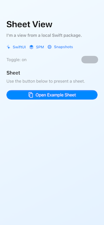
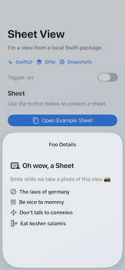

# HostedSnapshotHelper

Enables recording of views in Swift packages that need a key window.

This is useful for UI that does not render correctly in a package-only snapshot test, such as:

- `.sheet`
- `.fullScreenCover`
- `.alert`
- confirmation dialogs
- anything else that needs a real key window
- views containing a `Toggle` control from iOS 26 onward

## The problem

You are a good citizen and split your app into multiple packages. However, when you snapshot the views in the package, you notice something odd.

```swift
@Test
func testClosedState() {
  let sut = SheetView(isSheetPresented: true, toggleOn: false)
  assertSnapshot(of: sut, as: .image(layout: .device(config: .iPhone13)))
}
```

The snapshot does not show the sheet and, from iOS 26 onward, the `Toggle` has no content 🤔



The problem: the view needs a key window in order to show the sheet and properly draw the toggle.

You _could_ move all tests to the main app project, but that would break your carefully crafted architecture.

## The solution

```swift
@Test(.requiresKeyWindow)
func testSheetViewSheetOpenState() {
  let sut = SheetView(isSheetPresented: true, toggleOn: false)
  assertHostedSnapshot(of: sut, devices: [("iPhone13", .iPhone13)], wait: 1.0)
}
```

You annotate tests with `@Test(.requiresKeyWindow)` and call `assertHostedSnapshot(...)`. Et voila:



## How it works

It is a bit dirty 😅

1. A code generator scans your package tests for `@Test` methods tagged with `.requiresKeyWindow`.
2. It generates a new Swift Testing suite in your host app test target.
3. The generated tests run inside the app-hosted environment and render snapshot images with a real key window.
4. `verifySnapshot(...)` from [swift-snapshot-testing](https://github.com/pointfreeco/swift-snapshot-testing) compares those images to references.
5. If no reference image exists, the new image is written back to the package's `__Snapshots__` folder next to your regular package snapshots.

You can tell from this description that the process is brittle. But you cannot have your cake and eat it too.

## Installation

Add the package to both places:

- the package under test
- the host app Xcode project

```swift
.package(url: "https://github.com/teufelaudio/HostedSnapshotHelper.git", from: "0.0.1")
```

### Package under test

Add `HostedSnapshotHelper` to the package that owns your Swift Testing snapshot tests.

Example:

```swift
// swift-tools-version: 6.2

import PackageDescription

let package = Package(
  name: "FeaturePackage",
  dependencies: [
    .package(url: "https://github.com/pointfreeco/swift-snapshot-testing", from: "1.0.0"),
    .package(url: "https://github.com/teufelaudio/HostedSnapshotHelper.git", from: "0.0.1"),
  ],
  targets: [
    .target(name: "Feature"),
    .testTarget(
      name: "FeatureTests",
      dependencies: [
        "Feature",
        .product(name: "HostedSnapshotHelper", package: "HostedSnapshotHelper"),
        .product(name: "SnapshotTesting", package: "swift-snapshot-testing"),
      ]
    ),
  ]
)
```

### Writing tests

Keep ordinary snapshots unchanged:

```swift
import SnapshotTesting
import Testing
import Feature

@MainActor
struct FeatureSnapshotTests {
  @Test
  func testClosedState() {
    let sut = FeatureView()

    assertSnapshot(
      of: sut,
      as: .image(layout: .device(config: .iPhoneSe))
    )
  }
}
```

For key-window cases, tag the test with `@Test(.requiresKeyWindow)` and use `assertHostedSnapshot(of:)`:

```swift
import SnapshotTesting
import Testing
import Feature
import HostedSnapshotHelper

@MainActor
struct FeatureSnapshotTests {
  @Test(.requiresKeyWindow)
  func testSheetOpenState() {
    let sut = FeatureView(isSheetPresented: true)
    assertHostedSnapshot(of: sut)
  }
}
```

You can customize hosted assertions much like `assertSnapshot(...)` wrappers:

```swift
assertHostedSnapshot(
  of: sut,
  devices: [
    ("iPhoneSE3rdGen", .iPhoneSE3rdGen),
    ("iPadPro12_9", .iPadPro12_9(.portrait)),
  ],
  style: [.light, .dark],
  wait: 0.5,
  named: "dark",
  record: nil,
  timeout: 5
)
```

### What `.requiresKeyWindow` does

`.requiresKeyWindow` is a custom `Testing` trait provided by this package.

In package tests, it behaves like this:

- disable hosted tests by default
- keep them discoverable by the generator

If you want to run those package tests directly anyway, set:

```sh
RUN_HOSTED_PACKAGE_TESTS=1
```

You can also provide a custom disable message:

```swift
@Test(.requiresKeyWindow("Hosted snapshots run in the app-hosted test suite."))
func testSheetOpenState() {
  let sut = FeatureView(isSheetPresented: true)
  assertHostedSnapshot(of: sut)
}
```

### Host app integration

Add the package to the host app Xcode project and link `HostedSnapshotHelper` in the host app test target.

The host app test target must also be able to import the package under test.

Typical setup:

- app target imports the feature package normally
- app test target links `HostedSnapshotHelper`
- generated Swift Testing host file is written into the app test target's source directory

It is recommended to create a test plan that includes both:

- tests from the Swift package
- tests from the host app

### Xcode build phase

Add a Run Script build phase so the host app regenerates hosted tests before running tests.

Example:

```sh
set -eu

OUTPUT_DIR="${SRCROOT}/MyAppTests"
DEPENDENCIES_FILE_LIST="${SRCROOT}/MyAppTests/HostedSnapshotDependencies.xcfilelist"
PACKAGE_ROOT="${SRCROOT}/FeaturePackage"
HELPER_ROOT="${SRCROOT}/HostedSnapshotHelper"

env -u SDKROOT -u PLATFORM_NAME -u EFFECTIVE_PLATFORM_NAME -u ARCHS \
  xcrun --sdk macosx swift run \
  --package-path "$HELPER_ROOT" \
  HostedSnapshotRegistryGenerator \
  --package "$PACKAGE_ROOT" \
  --output-dir "$OUTPUT_DIR" \
  --dependencies-file-list "$DEPENDENCIES_FILE_LIST"
```

Notes:

- use `xcrun --sdk macosx swift run`
  The generator is a macOS host tool, not an iOS binary.
- unset `SDKROOT`, `PLATFORM_NAME`, `EFFECTIVE_PLATFORM_NAME`, and `ARCHS`
  Xcode can leak iOS build settings into `swift run`, which breaks SwiftPM manifest evaluation.
- write generated files into the host app test target directory via `--output-dir`
  (`<PackageName>HostedSnapshotTests.generated.swift`)
- pass `--dependencies-file-list` to emit an `.xcfilelist` containing all tagged test source files (`@Test(.requiresKeyWindow)`)
- add `$(SRCROOT)/MyAppTests/HostedSnapshotDependencies.xcfilelist` to the build phase **Input File Lists**
  so the script phase only reruns when those tagged files change
- if you integrate `HostedSnapshotHelper` as a remote Xcode package instead of a sibling checkout, `HELPER_ROOT` is typically:
  `"$SOURCEPACKAGES_DIR_PATH/checkouts/HostedSnapshotHelper"`

### Generator rules

The generator scans Swift files in the package and looks for tests under `Tests` that are tagged with `.requiresKeyWindow`.

For each hosted test, it requires:

- exactly one `assertHostedSnapshot(...)` call
- a self-contained test body that can be replayed in the host app test target

It preserves:

- the test body
- non-`Testing` imports from the source file
- top-level support declarations (for example helper functions and extensions)
- the original package snapshot directory
- the original package test name

That last point is important: hosted snapshots are rendered in the app, but saved in the package's snapshot folder.

### Constraints

- each tagged hosted test must contain exactly one `assertHostedSnapshot(...)` call
- tagged tests should avoid wrappers that hide or duplicate hosted assertions
- imports used by tagged package tests must also be valid in the host app test target

### Example project

A full working example lives in `Example/`:

- `Example/LocalExamplePackage` is the package under test
- `Example/SnapshotsInPackages` is the host app
- `Example/SnapshotsInPackagesTests/LocalExamplePackageHostedSnapshotTests.generated.swift` is generated from tagged package tests

